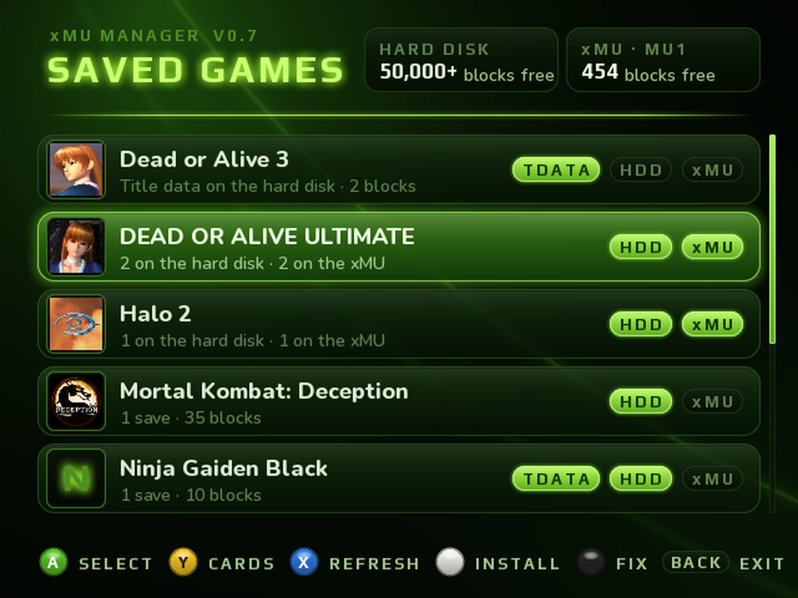
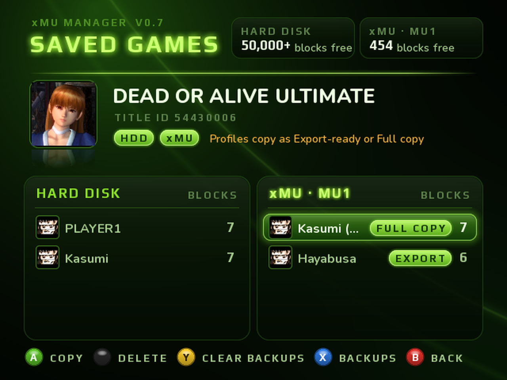
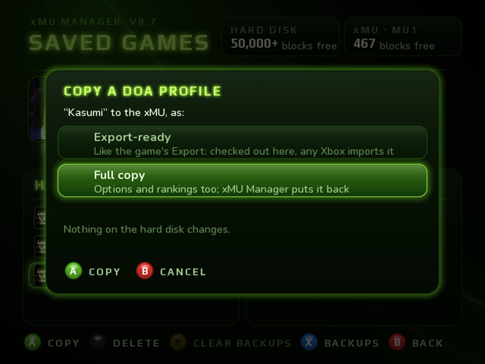
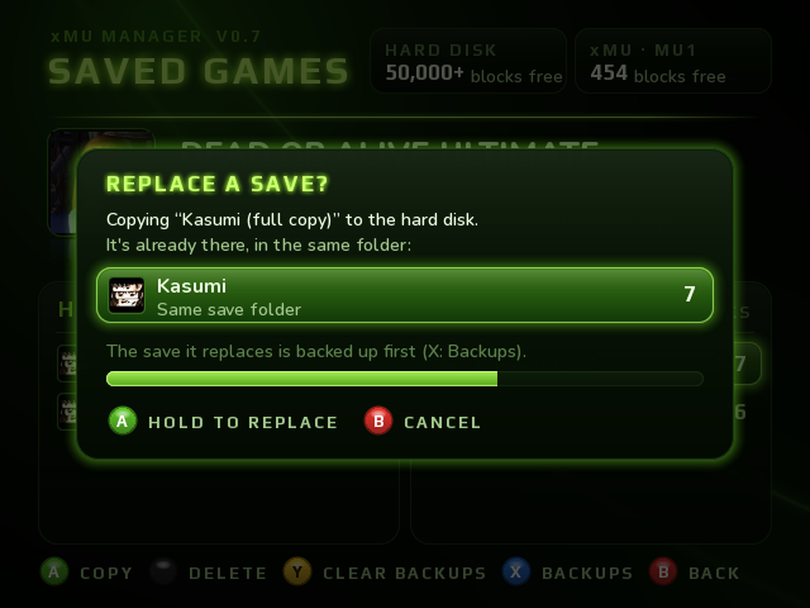
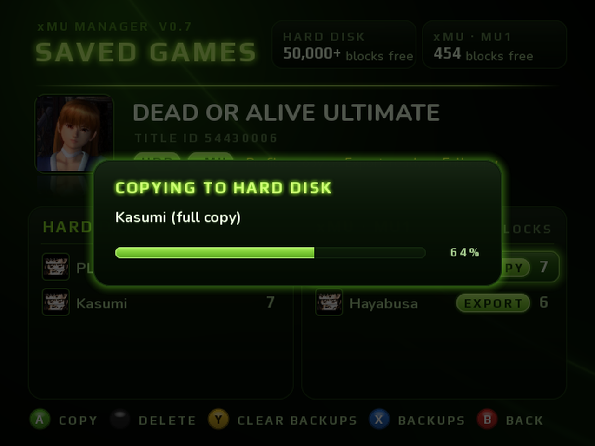
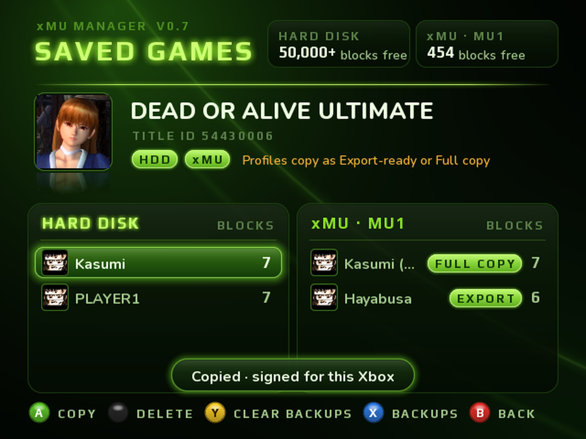
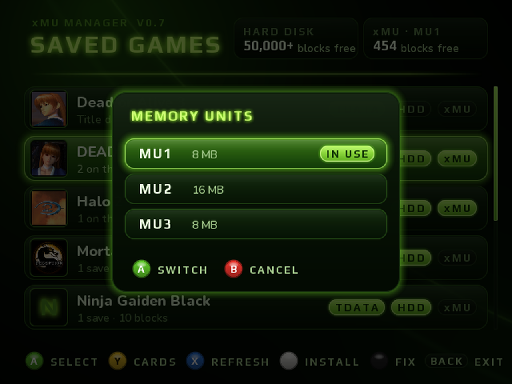

# xMU Manager

An app for modded original Xbox consoles that moves saves between the hard disk and your **xMU**. It also works with games that never use a memory unit (Silent Hill 4, Dead or Alive 3…) and games that lock their saves to one console.

**[⬇ Download the latest release](https://github.com/Retroteck/xMU-Manager/releases/latest)**: xMU Manager v0.7 (beta) + xMU firmware 1.6.0

## Features

- **Hard disk and xMU side by side.** Every game's saves, with the game art and save icons.
- **Copy either way**, including saves the Microsoft dashboard won't copy.
- **Locked saves are re-signed** for the Xbox you copy them to, so they don't show up as "corrupted". Tested on hardware: Dead or Alive Xtreme Beach Volleyball, Ninja Gaiden, Ninja Gaiden Black, Dead or Alive Ultimate (DOA1U and DOA2U).
- **Dead or Alive Ultimate profiles** move as a game export or as a **full copy** that keeps your unlocks and settings.
- **Fix saves**: repairs locked saves on the hard disk that were signed on another console.
- **Everything is backed up** to `E:\xMU\Backup` before it's replaced or deleted, and you can restore backups from the app.
- **Switch xMU cards and modes from the controller.** The xMU goes back to its previous mode when you exit.
- **Install panel (WHITE):** installs the app to `E:\Apps` and adds it to UnleashX. It also installs the XBMC4Gamers "Now Playing" scripts.

## Moving a Dead or Alive Ultimate profile

| | |
|---|---|
|  |  |
|  |  |
|  |  |

*The screenshots are the app's real interface, rendered on a PC.*

## What you need

- An **xMU** on **firmware 1.6.0** or newer. The `.uf2` files for RP2040 and RP2350 boards are in the release.
- A modded Xbox that can run homebrew.
- An FTP client or an Xbox file manager to copy the app over.

## Install

1. Flash the `.uf2` for your xMU from the release's `firmware` folder. Check the version under *Hold Right Button → Settings → About → Version*.
2. Copy the `xMU Manager` folder to your Xbox, for example `E:\Apps\xMU Manager\`.
3. Plug the xMU into a controller and start xMU Manager from your dashboard. You don't need to put the xMU in Xbox mode yourself. The app switches it and puts it back when you leave.

The full controller guide is in `README.txt` inside the release.

## Controls

| Home screen | | Game screen | |
|---|---|---|---|
| **A** | open the game | **A** | copy the save to the other side |
| **Y** | pick another xMU card | **BLACK** | delete (hold A to confirm) |
| **X** | refresh | **X** | backups (hold A to restore) |
| **WHITE** | install panel | **Y** | clear this game's backups |
| **BLACK** | fix saves | **B** | back |
| **BACK** | exit to the dashboard | | |

In-game reset (**L + R + BACK + START**) also works inside the app.

## Known limits (beta)

- Card switching, automatic mode switching and the OLED status screen need firmware 1.6.0.
- Shows up to 160 games and up to 16 saves per game on each side.
- Only xMU memory units are supported, not official Microsoft MUs.
- Title data (`E:\TDATA`) and downloadable content are listed but not copied, same as the Microsoft dashboard.

## Credits

Built with [nxdk](https://github.com/XboxDev/nxdk), SDL2, SDL_ttf and FreeType. The save signing layouts are based on feudalnate's Original Xbox Gamesave Resigners research. Font and library licenses are in the release's `licenses` folder.

Not affiliated with or endorsed by Microsoft, Koei Tecmo, Team NINJA or any game publisher. Use at your own risk, and keep your backups safe.
