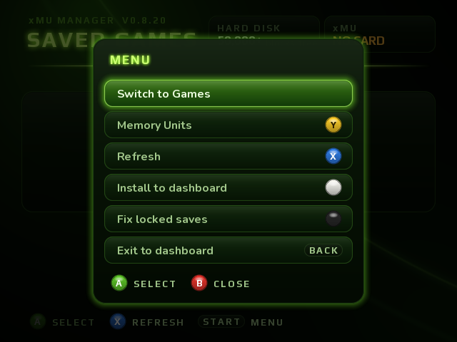
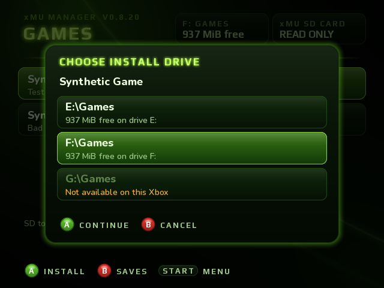
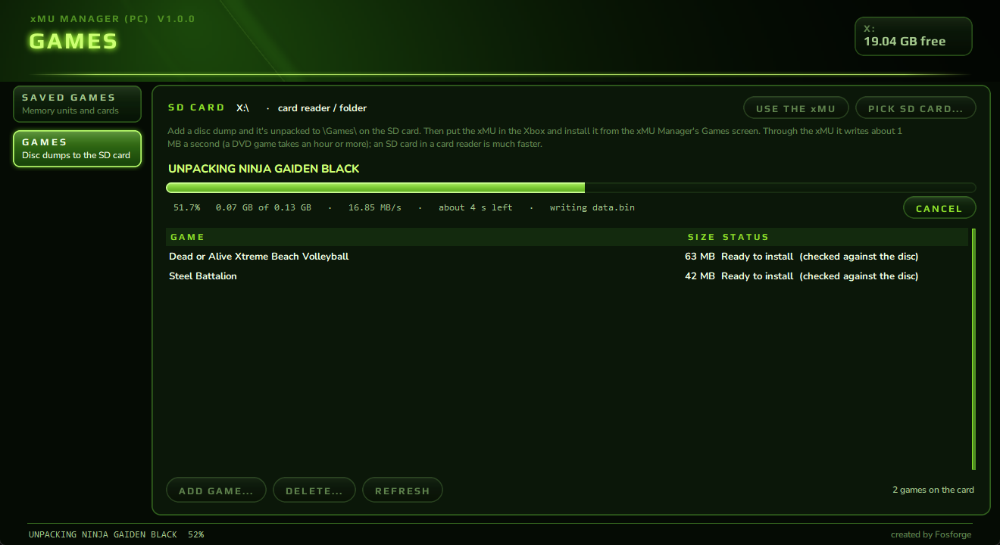

# xMU Manager

An app for modded original Xbox consoles that moves saves between the hard disk and your **xMU**, and installs games from the xMU's SD card. It also works with games that never use a memory unit (Silent Hill 4, Dead or Alive 3…) and games that lock their saves to one console.

**New: xMU Manager (PC)** for Windows manages the memory units on the xMU's card and unpacks your disc dumps onto the SD card, ready to install on the Xbox. [See below](#xmu-manager-pc).

**[⬇ Download the latest release](https://github.com/Retroteck/xMU-Manager/releases/latest)**: xMU Manager 0.8.31 (Xbox) + xMU Manager (PC) 1.0 + xMU firmware 1.6.7

## Features

- **Hard disk and xMU side by side.** Every game's saves, with the game art and save icons.
- **Copy either way**, including saves the Microsoft dashboard won't copy.
- **Install games from the SD card.** Add your disc dumps with xMU Manager (PC), or copy extracted game folders into `Games` on the xMU's SD card, then install them to E:, F: or G:. Every file is read back and checked (against the original disc for games added with the PC app), and a stopped install picks up where it left off.
- **Locked saves are re-signed** for the Xbox you copy them to, so they don't show up as "corrupted". Tested on hardware: Dead or Alive Xtreme Beach Volleyball, Ninja Gaiden, Ninja Gaiden Black, Dead or Alive Ultimate (DOA1U and DOA2U).
- **Ninja Gaiden Black copies as a whole:** every slot plus the system data that holds your unlocks and play times.
- **Dead or Alive Ultimate profiles** move as a game export or as a **full copy** that keeps your unlocks and settings.
- **Dead or Alive 3 and Steel Battalion** progress copies between Xboxes, though those games keep it outside their saves.
- **Card names:** your xMU cards are listed by name, and you can rename them from the controller (firmware 1.6.7).
- **Fix saves**: repairs locked saves on the hard disk that were signed on another console.
- **Everything is backed up** to `E:\xMU\Backup` before it's replaced or deleted, and you can restore backups from the app.
- **Switch xMU cards and modes from the controller.** The xMU goes back to its previous mode when you exit.
- **Install to dashboard:** installs the app to `E:\Apps` and adds it to UnleashX.

## Moving a Dead or Alive Ultimate profile

| | |
|---|---|
|  |  |
|  |  |
|  |  |

## Installing games

| | |
|---|---|
|  |  |

1. On the PC, open xMU Manager (PC) > **Games** > **ADD GAME...** and pick your disc dump. Or put the xMU in PC mode and copy extracted game folders into `Games` on the SD card yourself, one folder per game with its `default.xbe` (`Games\Halo\default.xbe`).
2. In xMU Manager on the Xbox, open the START menu and pick **Switch to Games**.
3. Press **A** on a game, pick the drive, then hold **A** to install.

Expect about 1 GB every 20 minutes. The Xbox's USB 1.1 port is the limit.

## What you need

- An **xMU** on **firmware 1.6.2** or newer (1.6.7 is in the release). The `.uf2` files for RP2040 and RP2350 boards are in the release.
- A modded Xbox that can run homebrew.
- An FTP client or an Xbox file manager to copy the app over.

## Install

1. Flash the `.uf2` for your xMU from the release's `firmware` folder. Check the version under *Hold Right Button → Settings → About → Version*.
2. Copy the `xMU Manager` folder to your Xbox, for example `E:\Apps\xMU Manager\`.
3. Plug the xMU into a controller and start xMU Manager from your dashboard. You don't need to put the xMU in Xbox mode yourself. The app switches it and puts it back when you leave.

The full controller guide is in `README.txt` inside the release.

## Controls

| Saves | | Game screen | | Games | |
|---|---|---|---|---|---|
| **A** | open the game | **A** | copy the save to the other side | **A** | install |
| **X** | refresh | **BLACK** | delete (hold A to confirm) | **B** | stop / back to Saves |
| **START** | menu | **X** | backups (hold A to restore) | **X** | refresh |
| | | **Y** | clear this game's backups | **START** | menu |
| | | **B** | back | | |

The old buttons still work as shortcuts on Saves: **Y** cards, **WHITE** install to dashboard, **BLACK** fix saves, **BACK** exit.

In-game reset (**L + R + BACK + START**) also works inside the app.

## Known limits

- Needs firmware 1.6.2 or newer to use the xMU, 1.6.6 or newer for the full transfer speed on RP2350 xMUs, and 1.6.7 for card names. Firmware 1.6.7 hasn't been tested on RP2040 hardware.
- Games: folders only on the SD card (xMU Manager (PC) unpacks ISOs to folders), SD card to hard disk only.
- Only xMU memory units are supported, not official Microsoft MUs.
- Title data (`E:\TDATA`) and downloadable content are listed but not copied, same as the Microsoft dashboard (Ninja Gaiden Black's system data, Dead or Alive 3's save and Steel Battalion's pilots are the exceptions).
- XBMC4Gamers "Now Playing" is switched off for now while it's reworked. If an older version installed it, remove it from Install to dashboard (pick XBMC4Gamers, press Y).

## xMU Manager (PC)

A Windows app with the same look, for everything that's easier on a PC:

- **Games:** **ADD GAME...** unpacks a disc dump (.iso, split dumps too) to `\Games\` on the SD card. It goes through the xMU over USB (about 1 MB/s) or to the SD card in a card reader (much faster). It shows the size and time first, can be cancelled and resumed, and writes a checksum list of the disc so the Xbox checks every file against it.
- **Saved games:** every memory unit on the xMU's card at once. Export, Import, Copy to another card, Delete, Rename, New memory unit, Reorder cards.
- **Check card / Fix signatures**, plus Dead or Alive Ultimate and Ninja Gaiden Black unlocks.
- **Every card is backed up on the PC before every change**, and UNDO CHANGES puts one back.
- You don't switch the xMU's mode yourself: the app does it, and gives it back when you close it.

Unzip `xMU_Manager_PC_1.0.0_Windows.zip` and run `xMU Manager (PC).exe` (Windows 10/11). It asks for administrator rights, and it isn't signed, so SmartScreen may warn: *More info → Run anyway*. Firmware 1.6.1 or newer.

Only dump discs you own.

## Credits

Built with [nxdk](https://github.com/XboxDev/nxdk), SDL2, SDL_ttf, FreeType and FatFs; the PC app with Python, Tk, Pillow and PyInstaller. The save signing layouts are based on feudalnate's Original Xbox Gamesave Resigners research. Font and library licenses are in the release's `licenses` folder.

Not affiliated with or endorsed by Microsoft, Koei Tecmo, Team NINJA or any game publisher. Use at your own risk, and keep your backups safe.
